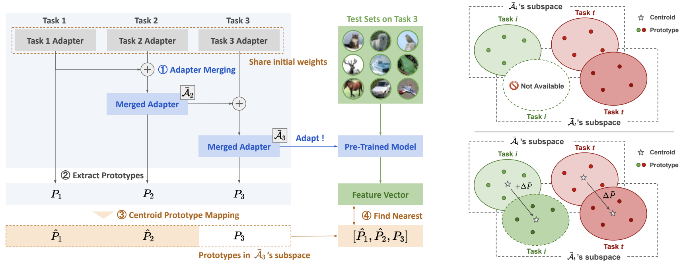

<div align="center">
<h1>Adapter Merging with Centroid Prototype Mapping <br> for Scalable Class-Incremental Learning</h1>

[](https://github.com/tf63/ACMap/stargazers)
[](https://arxiv.org/abs/2412.18219)
[](https://cvpr.thecvf.com/virtual/2025/poster/32443)


<!--  -->


<i>Takuma Fukuda</i>, <i>Hiroshi Kera</i>, <i>Kazuhiko Kawamoto</i>

<!-- [[arxiv]](https://arxiv.org/abs/2412.18219) | [[poster]](https://cvpr.thecvf.com/virtual/2025/poster/32443) -->

**Abstract**

We propose Adapter Merging with Centroid Prototype Mapping (ACMap), an exemplar-free framework for classincremental learning (CIL) that addresses both catastrophic
forgetting and scalability. While existing methods tradeoff between inference time and accuracy, ACMap consolidates task-specific adapters into a single adapter, ensuring constant inference time across tasks without compromising accuracy. The framework employs adapter merging to build a shared subspace that aligns task representations and mitigates forgetting, while centroid prototype
mapping maintains high accuracy through consistent adaptation in the shared subspace. To further improve scalability, an early stopping strategy limits adapter merging
as tasks increase. Extensive experiments on five benchmark datasets demonstrate that ACMap matches state-ofthe-art accuracy while maintaining inference time comparable to the fastest existing methods

</div>



### 📰 News

-   [2025/02/27] 🎉 Our paper has been accepted to CVPR2025!!
-   [2024/12/24] 📄 [arxiv](https://arxiv.org/abs/2412.18219) paper has been released.
-   [2024/12/24] 🏁 Code has been released.

### 💐 Acknowledgements

We extend our gratitude to the authors of the following resources for their invaluable contributions to the field of class-incremental learning, which significantly informed and inspired our research:

-   [Deep Class-Incremental Learning: A Survey](https://github.com/zhoudw-zdw/CIL_Survey)
-   [PILOT: A Pre-Trained Model-Based Continual Learning Toolbox](https://github.com/sun-hailong/LAMDA-PILOT)
-   [Revisiting Class-Incremental Learning with Pre-Trained Models: Generalizability and Adaptivity are All You Need](https://github.com/zhoudw-zdw/RevisitingCIL)
-   [Expandable Subspace Ensemble for Pre-Trained Model-Based Class-Incremental Learning](https://github.com/sun-hailong/CVPR24-Ease)

## 💬 Installation

This repository supports two setup methods:

-   ⭐️ **A. Container setup with Docker (recommended)**
-   👻 **B. Local setup with Rye**

Windows is not supported, so please refer to `docker/Dockerfile` and `pyproject.toml` to set up the environment manually.

### ⭐️ A. Container setup with Docker (recommended)

Build the Docker container:

```shell
bash docker.sh build
```

Create a `.env` file by copying `.env.example`. **Be sure to exclude `.env` from version control**.

```shell
cp .env.example .env
```

Start the container shell:

```shell
bash docker.sh shell
```

### 👻 B. Local setup with Rye

If you haven't installed [Rye](https://rye.astral.sh/guide/installation/) yet, run:

```shell
curl -sSf https://rye.astral.sh/get | bash
```

You can install Python and the necessary packages:

```shell
rye sync
```

## 🌠 Dataset Preparation

Download the datasets with `cmd/download.py` from the [source](https://github.com/sun-hailong/CVPR24-Ease), and extract its contents:

```shell
python3 cmd/download.py --help

    Usage: download.py [OPTIONS]

    Options:
        --name TEXT     Dataset name (CUB200|ImageNet-R|ImageNet-A|VTAB)  [required]
        --out_dir TEXT  Download destination  [required]
        --help          Show this message and exit
```

> These datasets are referenced from the [APER](https://github.com/zhoudw-zdw/RevisitingCIL).
>
> -   **CIFAR100**: will be automatically downloaded by the code.
> -   **CUB200**: Google Drive: [link](https://drive.google.com/file/d/1XbUpnWpJPnItt5zQ6sHJnsjPncnNLvWb/view?usp=sharing) or Onedrive: [link](https://entuedu-my.sharepoint.com/:u:/g/personal/n2207876b_e_ntu_edu_sg/EVV4pT9VJ9pBrVs2x0lcwd0BlVQCtSrdbLVfhuajMry-lA?e=L6Wjsc)
> -   **ImageNet-R**: Google Drive: [link](https://drive.google.com/file/d/1SG4TbiL8_DooekztyCVK8mPmfhMo8fkR/view?usp=sharing) or Onedrive: [link](https://entuedu-my.sharepoint.com/:u:/g/personal/n2207876b_e_ntu_edu_sg/EU4jyLL29CtBsZkB6y-JSbgBzWF5YHhBAUz1Qw8qM2954A?e=hlWpNW)
> -   **ImageNet-A**: Google Drive: [link](https://drive.google.com/file/d/19l52ua_vvTtttgVRziCZJjal0TPE9f2p/view?usp=sharing) or Onedrive: [link](https://entuedu-my.sharepoint.com/:u:/g/personal/n2207876b_e_ntu_edu_sg/ERYi36eg9b1KkfEplgFTW3gBg1otwWwkQPSml0igWBC46A?e=NiTUkL)
> -   **VTAB**: Google Drive: [link](https://drive.google.com/file/d/1xUiwlnx4k0oDhYi26KL5KwrCAya-mvJ_/view?usp=sharing) or Onedrive: [link](https://entuedu-my.sharepoint.com/:u:/g/personal/n2207876b_e_ntu_edu_sg/EQyTP1nOIH5PrfhXtpPgKQ8BlEFW2Erda1t7Kdi3Al-ePw?e=Yt4RnV)
>
> https://github.com/zhoudw-zdw/RevisitingCIL

## 🚵 Training

To start training, run the following command:

```bash
python3 src/acmap/train.py --config exps/cifar.yaml --dataset_dir ./dataset
```

The adapter checkpoints for each task will be saved in `./data/acmap/ckpts/`.
To skip saving checkpoints, include the `--debug` option.

To adjust the initial number of classes (`init_cls`) and the incremental step size (`increment`), run:

```
python3 src/acmap/train.py --init_cls 20 --increment 20
```

For more details, refer to `src/acmap/utils/options.py`.

### (Optional) Logging with W&B

We support logging with [W&B](https://wandb.ai/) for tracking experiments and visualizing results.
To enable this, obtain an API key from [W&B](https://wandb.ai/) and add it to `.env`, then run the following command:

```bash
python3 src/acmap/train.py --logger wandb
```

## Citation
```bibtex
@InProceedings{Fukuda_2025_CVPR,
    author    = {Fukuda, Takuma and Kera, Hiroshi and Kawamoto, Kazuhiko},
    title     = {Adapter Merging with Centroid Prototype Mapping for Scalable Class-Incremental Learning},
    booktitle = {Proceedings of the Computer Vision and Pattern Recognition Conference (CVPR)},
    month     = {June},
    year      = {2025},
    pages     = {4884-4893}
}
```
